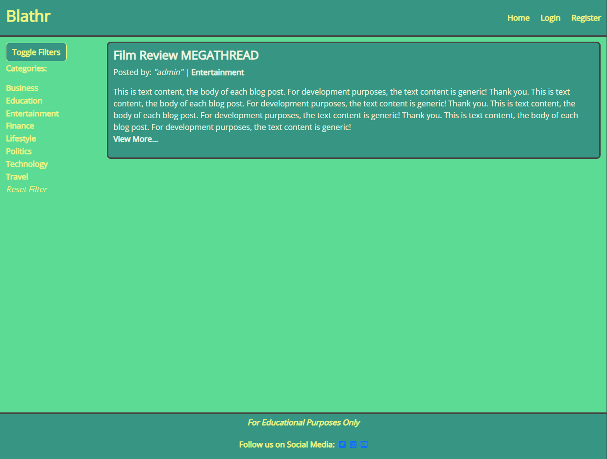

# Blathr

**Developer: Samuel Masters**

💻 [Visit live website](https://blathr-discussion.herokuapp.com/)

## Table of Contents
  - [About](#about)
  - [User Goals](#user-goals)
  - [Site Owner Goals](#site-owner-goals)
  - [User Experience](#user-experience)
  - [User Stories](#user-stories)
  - [Design](#design)
    - [Colours](#colours)
    - [Fonts](#fonts)
    - [Structure](#structure)
      - [Website pages](#website-pages)
      - [Database](#database)
    - [Wireframes](#wireframes)
  - [Technologies Used](#technologies-used)
  - [Features](#features)
  - [Validation](#validation)
  - [Testing](#testing)
    - [CRUD Testing](#crud-testing)
  - [Bugs](#bugs)
  - [Configuration](#configuration)
    - [Heroku Deployment](#heroku-deployment)
  - [Credits](#credits)

### About

Blathr is a web application where users can share discussions with each other, by writing and commenting on blog posts.

### User Goals

- Write blog posts for a variety of topics
- Comment on blog posts to engage in discussions with other users
- Browse other users blog posts

### Site Owner Goals

- Create an online space where users can write their own blog posts. 
- Allow for interaction with other users via post comments. 

## User Experience

### Target Audience

- People who enjoy browsing written content created by other users. 
- People who wish to communicate with other users to discuss topics.

### User Requirements and Expectations

- Minimal, 'clean' design
- Intuitive navigation
- Engaging visual design
- Full CRUD functionality

##### Back to [top](#table-of-contents)

## User Stories

User stories were created at project start and were arranged in a kanban board hosted within the project's GitHub repository. They were prioritised using the MoSCoW format.

### Users

1.	As a user, I can create an account so that I can login to the site. (**Must Have**)
2.	As a user, I can create posts so that I can write about topics that interest me. (**Must Have**)
3.	As a user, I can upvote or downvote posts so that I can show that I like or dislike a specific post. (**Won't Have**)
4.	As a user, I can leave comments on posts so that I can take part in discussions with other users.  (**Must Have**)
5.	As a user, I can edit my own posts after they've been published so that I can make change to my posts' content at a later date. (**Should Have**)
6.	As a user, I can delete my own comments so that I can withdraw my contribution to a discussion after it has been published. (**Won't Have**)
7.	As a user, I can add images to my own posts so that I can create more interesting and visually engaging posts. (**Won't Have**)
8.	As a user, I can edit my post so that I can make changes to it's content after initial publication (with reapproval required).  (**Must Have**)
9.	As a user, I can delete my own posts so that I can remove my own contributed content if I so wish.  (**Must Have**)
10.	As a user, I can filter posts on the front page by category so that I can browse only posts that are in categories I'm interested in. (**Could Have**)

### Site Owner
11.	As an admin, I can approve or disapprove user posts so that I can moderate the site's content and prevent harmful or offensive posts from being shown to other users.  (**Must Have**)
12.	As an admin, I can create additional discussion categories so that I can create additional space on the site for more topics of conversation. (**Could Have**)
13.	As an admin, I can delete user accounts and their content so that I can block harmful users from using the site. (**Could Have**)
14.	As an admin, I can approve or disapprove comments on posts so that I can more effectively moderate the content of the site. (**Should Have**)

##### Back to [top](#table-of-contents)

## Design

### Colours

The colour scheme uses bright colours with darker accents, a design choice made with the aim of grabbing a user's attention when they visit the page. Light colours were used against darker background to help keep text visible and easily readable. 

The colour scheme was discovered from [Visme.co](https://visme.co/blog/website-color-schemes/), and was listed as #4 "Cool and Fresh".

### Fonts

Google Fonts was used to provide the font for the website. [Open Sans](https://fonts.google.com/specimen/Open+Sans?query=Open+Sans) was chosen as the universal font for the page, and was chosen for it's simplicity.

### Structure

#### Website Pages

The website only uses a few different templates / pages to comprise it's structure.

The top of each page features a simple customised Bootstrap 5 navbar, with navigation links which change depending on whether the user is authenticated on-site or not. For example, an anonmyous user will see options for Home / Login / Register whereas an authenticated user will instead see options for Home / Create Post / Logout.

The bottom of each page features a very simple footer with dummy social links.

- The website consists of the following sections:
  - An "index" / home page where posts will be displayed, with the most recent posts at the top. A dropdown sidebar contains a list of category filters which users can click or tap to apply to the displayed posts. Long posts on this page have their previewed content limited to 600 characters to prevent oversized posts from appearing where users may instead wish to initially browse before reading further.
  - A filtered, separate version of the home page which is identical in structure but only shows posts related to a category which the user has selected from the sidebar.
  - A post detail page, accessed from the "View More..." link on each post shown on the home page. This page displays the entire text content of a post, so longer posts can be viewed in their entirety here. A comment section appears underneath each post where authenticated users will see an input fields to write and submit their comments if they wish.
  - An edit post page, accessed from a conditional "Edit" button which only appears to the authenticated author of a post. It contains a basic form which allows a user to submit an update to the text content of their posts.
  - A create post page where authenticated users can view a form which lets them create a post by specifying a title, writing some text content, and assigning a category to their new post.
  - Authentication pages for signing in, signing out, and registering an account. These pages are provided by django-allauth, and were customised to match the site's colour scheme. 

#### Database

- Data for this project is stored is a Postgres database allocated by Heroku.

The following models were setup for this project:

##### User Model
- Django-allauth provided a user model that was used in this project. The model was not customised.

##### Post Model
- This model contains information about each individual post created on the site.
- It contains the following fields:
  - post_id
  - title
  - author
  - created_date
  - content
  - category
  - status

##### Category Model
- This model contains information about different categories to which posts can be assigned.
- It contains the following fields:
  - category_id
  - name

##### Comment Model
- This model contains information about comments which can be left on posts by users.
- It contains the following fields:
  - post
  - name
  - body
  - created_on
  - approved

### Wireframes

PC / Laptop or Desktop

Tablet

Mobile

Model Planning

## Technologies Used

### Languages & Frameworks

- HTML
- CSS
- Javascript
- Python
- Django

### Libraries & Tools

- [Am I Responsive](http://ami.responsivedesign.is/) was used to create the responsive example image at the start of this README.
- [Balsamiq](https://balsamiq.com/) was used to create wireframes for the project.
- [Bootstrap v5.2.0](https://getbootstrap.com/) was used to provide various elements such as buttons, div structure, and navbars.
- [Cloudinary](https://cloudinary.com/) was used to remotely store static files, ahead of Heroku deployment.
- [Django-allauth](https://django-allauth.readthedocs.io/en/latest/index.html) was used to provide simple authentication tools for the project.
- [Favicon.io](https://favicon.io) provided the project's favicon.
- [GitHub](https://github.com/) hosted the project and all files.
- [Google Fonts](https://fonts.google.com/) was used to provide the font used across the project.
- [Heroku Platform](https://id.heroku.com/login) allowed for live deployment of the project.
- [Postgres](https://www.postgresql.org/) was the database provisioned for use with the project on Heroku.
- Validation:
  - [WC3 Validator](https://validator.w3.org/) - used for validation of HTML files
  - [Jigsaw W3 Validator](https://jigsaw.w3.org/css-validator/) - used for validation of CSS files
  - [JShint](https://jshint.com/) - used for validation of JS files
  - [PEP8](http://pep8online.com/) - used for validation of Python files

##### Back to [top](#table-of-contents)

--- 

## Features

### Navigation Bar
- Consistent across all pages, the navigation bar is setup in the base.html template, which all other templates extend.
- Contains links to Home, and:
  - If the user is authenticated:
      - Create Post, where users can create their own posts
      - Logout, where users can sign out of their account
  - If the user is not authenticated:
      - Login, where users can sign in with an existing account
      - Register, where users can create a new account

### Home
- The home page acts as the 'hub' of the site. Here, posts which have been approved by admins are iterated through for users to browse. An excerpt of 600 characters is the limit for each post. 
- Each post has a "View More..." link which leads users to the post detail page.
- A list of categories can be toggled on the left-hand side which, when clicked, leads users to a filtered version of the same page. 

### Home (Filtered)
- Identical to the regular home page, with the difference of only showing posts related to the category specified by the user when they clicked any category link.

### Post Detail
- Shows one post, in full. A comment section is attached to the bottom of each post's text content. If the user is authenticated when the page loads, then an input field will be present inviting the user to "Post a comment". Additionally, if the authenticated user is the author of said post, then "Edit" and "Delete Post" buttons will appear.

If not authenticated

If authenticated

If authenticated as author

.png)

### Edit
- Shows a basic input form where users can change the text content of either their posts' title or content.

### Authentication (Login, Logout, Register)
- Customised versions of the standard authentication templates provided by Django-allauth.

#### Sign-in

#### Sign-out

#### Sign-up

### Footer
- Basic footer, setup in the base.html template, and appears at the bottom of each page. Contains education disclaimer and dummy social links.

### Feedback messages
- The user receives a brief pop-up message after logging in, logging-out, submitting a new post or submitting a new comment.

##### Back to [top](#table-of-contents)

---

## Validation

The [W3C Validator](https://validator.w3.org/nu/) was used for validation of the HTML files in this project.

Home

Home (Filtered)

Post Detail

Sign-in

Sign-out

Sign-up

### CSS Validation
The [Jigsaw CSS validator](https://jigsaw.w3.org/css-validator/) was used for validation of the CSS files in this project.

### JavaScript Validation
[JSHint](https://jshint.com/) was used for validation of the JS files in this project. The validation was done via raw input, meaning the contents of script.js were copied into the validator.

### PEP8 Validation
[PEP8 Online](http://pep8online.com/) was used for validation of the Python files in this project.

settings.py

admin.py

forms.py

models.py

views.py

urls.py

manage.py

##### Back to [top](#table-of-contents)

---

## Testing

The project was tested throughout development, manually. Automated tests were not utilised for this project.

Testing primarily focused on the CRUD functionality of user posts.

### CRUD Testing

1. Creation of new posts
2. Reading and iteration of approved posts
3. Editing and updating of existing posts
4. Deletion of existing posts

**Step** | **Expected Result** | **Actual Result**
------------ | ------------ | ------------ |
Fill out and submit form presented to authenticated users on [add_post](https://blathr-discussion.herokuapp.com/add/add_post/) page | New post is successfully submitted to database and is visible from admin panel | Functionality works as expected |

**Step** | **Expected Result** | **Actual Result**
------------ | ------------ | ------------ |
Load [home page](https://blathr-discussion.herokuapp.com/), where created (approved) posts will be iterated through from the database | Posts shown in chronological order of creation in standardised format | Functionality works as expected |

**Step** | **Expected Result** | **Actual Result**
------------ | ------------ | ------------ |
Select "Edit" button, presented when an author of a post views the post detail page of their own post | Post title and content can be changed once edit form submitted, but require reapproval from admin | Functionality works as expected |

**Step** | **Expected Result** | **Actual Result**
------------ | ------------ | ------------ |
Select "Delete" button, presented when an author of a post views the post detail page of their own post, a warning modal appears to confirm user input | Post is deleted from the database and no longer shows on site | Functionality works as expected |

##### Back to [top](#table-of-contents)

---

## Bugs

1. UNRESOLVED - Small input boxes on "edit" page. Currently, the input fields where a post author can edit their posts' content are too small. This was investigated but unfortunately could not be resolved before project submission. The current functionality was left in to provide evidence of the requisite "update" part of CRUD.

2. UNRESOLVED / REVERTED - Prior to project submission, Summernote was integrated into the project and was intended for use within post creation to allow users to apply detailed formatting to their posts. However, Summernote's interface became heavily distorted and "squashed" whilst testing shortly before submission. With this in mind, the decision was made to remove Summernote functionality altogether before project submission. 

##### Back to [top](#table-of-contents)

---

## Configuration

### Heroku Deployment
This application has been deployed from GitHub to Heroku by following the steps:

1. Create or log in to your account at [heroku.com](https://heroku.com)
2. Create a new app, choose a unique app name for your app, and select your region.
3. Click "Create app".
4. Under the resources tab, type "postgres", and add a Postgres database to the app (a "Hobby" plan was used for this app).
5. Install the plugins dj-database-url and psycopg2-binary from the CLI in your workspace.
6. Install django and gunicorn from the CLI in your workspace.
7. Use the terminal command "pip3 freeze --local > requirements.txt" to generate your requirements.txt file, required for Heroku deployment.
8. Create a Procfile in your app and enter the following, replacing PROJECT_NAME with your app name: 
   (web: gunicorn PROJECT_NAME.wsgi)
9.  Ensure that your settings.py file is connected to your new Postgres database from Heroku.
10. In settings.py, check that Debug = False.
11. Under the "ALLOWED_HOSTS" variable in settings.py, make sure that 'localhost' and the deployed Heroku root url are included. 
12. Go to Settings in your Heroku and set the environment variables in the Config Vars
    
13. Remove DISABLE_COLLECTSTATIC from Heroku settings.
14. Push the code to Heroku using the command "git push heroku main" from your CLI.

Final steps:

- Select the "Deploy" tab from the top navigation bar.
- Select "Deployment method: GitHub
- Enter your GitHub credentials if prompted, and search for your project's repository in the search box provided. 
- Select your project, and choose whether to enable automatic deploys or not. 
- Select "main" branch, the "Deploy Branch".

### Forking the GitHub Repository
1. Go to the GitHub repository
2. Click on the fork icon in top right corner
3. You will then have am identical copy of that repository.
   

##### Back to [top](#table-of-contents)

---

## Credits

- [Visme.co](https://visme.co/blog/website-color-schemes/) for providing the project's colour scheme.
- [Dominic Fraser (FreeCodeCamp)](https://www.freecodecamp.org/news/how-to-keep-your-footer-where-it-belongs-59c6aa05c59c/) for a solution providing a fixed footer.
- [GeeksForGeeks](https://www.geeksforgeeks.org/detail-view-function-based-views-django/) for providing additional learning material around function-based views.
- [W3Schools](https://www.w3schools.com/django/django_add_record.php) for valuable refreshers on how to implement CRUD functionality on the front-end.
- ["Yilmaz" (StackOverflow)](https://stackoverflow.com/questions/45483417/what-is-doing-str-function-in-django) for a past answer which helped me understand more about the "__str__" method.

##### Back to [top](#table-of-contents)
